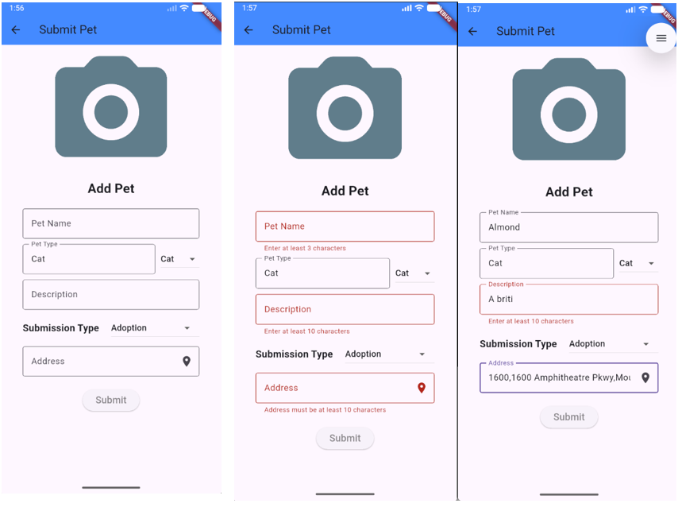
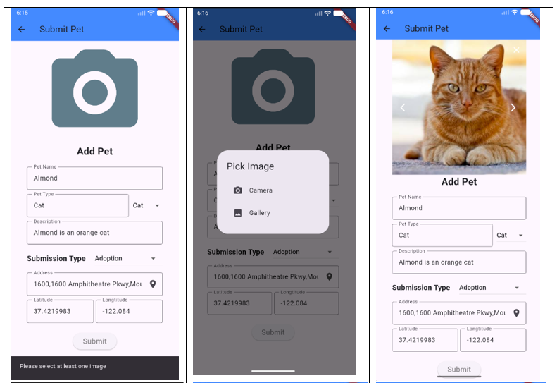
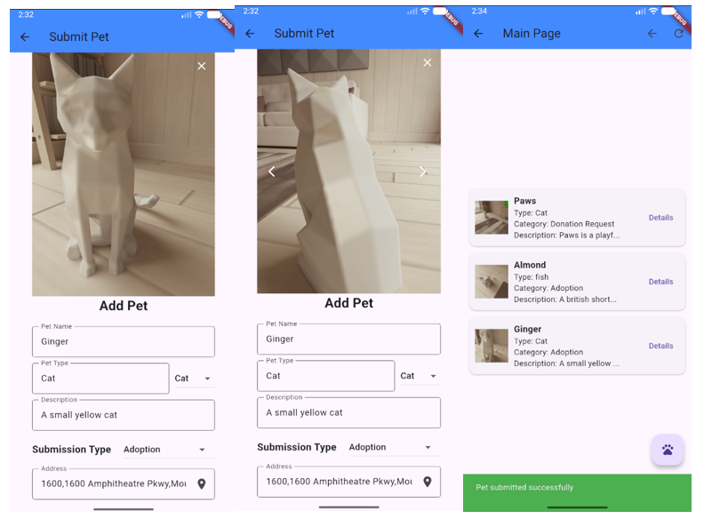
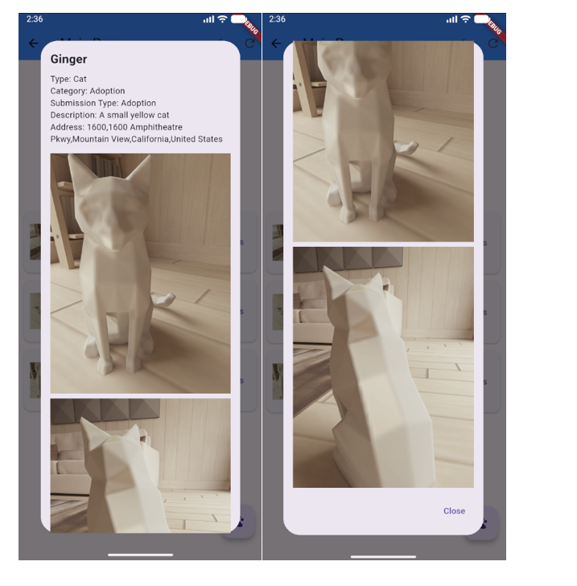

# pawpal

Setup Steps:
--
1) Create pawpal_db database

2) import both tbl_pets.sql and tbl_users.sql files into your database

3) create "pawpal" folder in your xamapp->htdocs and copy the server folder into it

4) modify the baseUrl value in lib/tabs/url.dart to your localhost adress

-The applicaiton should be able to run now

Flow:
--
   Submit pet <-> Main page <-> Login <-> Sign up 

API:

submitpetscreen interacts with submit_pet.php

submit_pet recieves pet details through post request, then processes the images sent as Json by decoding each one from base64 then saving the images inside "images/" folder generating a unique name for each one (userid_petname_counter_time.png) 
the ecounter is used to give a unique value for each image if multiple images were submitted at once, as time could be same since the loop processes too fast, then a json response is sent back to the submitpetscreen.dart.

Example of Json response:
--
Success:  sendJsonResponse(['success' => true,'message' => 'Pet submitted successfully']);

Failure: sendJsonResponse(['success' => false,'message' => 'Pet submition failed']);

Error: sendJsonResponse(['success' => false,'message' => 'An error occurred: ' . $e->getMessage()]);

Invalid request: sendJsonResponse(['success' => false, 'message' => 'Invalid Request']);

#

mainpage interacts with get_my_pets.php

get_my_pets fetches user's pets from the database using using "SELECT * FROM tbl_pets where user_id =?" after getting called during mainpage initialization, and returns the data if any to the dart file, which then creates a pet object for each returned row, and displays them on the screen

Example of Json response:

Success: sendJsonResponse(['success' => true,'message' => 'Fetched successfully','data' => $pets]);

Success-No Rows:  sendJsonResponse(['success' => true,'message' => 'No submissions yet']);

Failure:  sendJsonResponse(['success' => false,'message' => 'An error occurred: ' . $e->getMessage()]);

Invalid request: sendJsonResponse(['success' => false,'message' => 'Invalid Request']);

Location is auto filled (lat and long) from device  and auto converted to address to display to the user when submitting or retrieving pets
--

Screenshots
---

